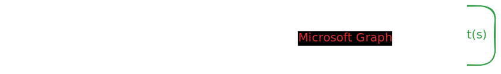
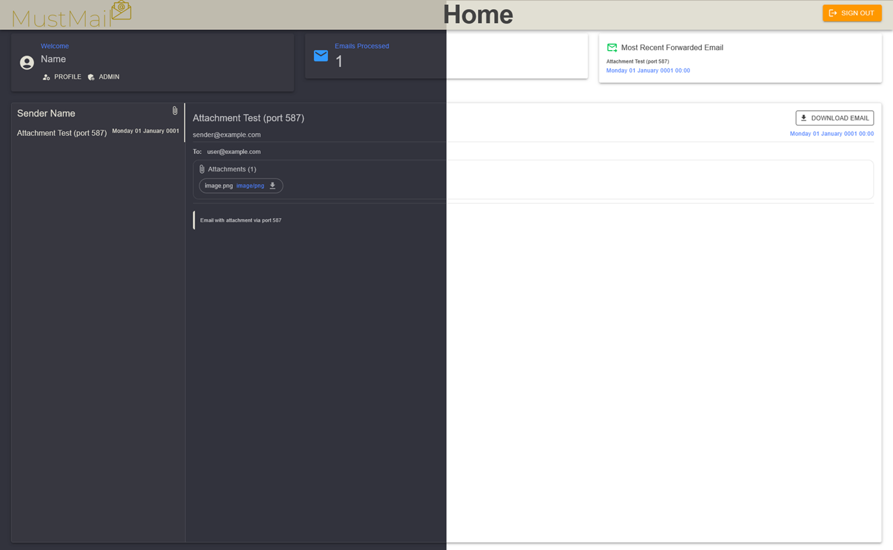
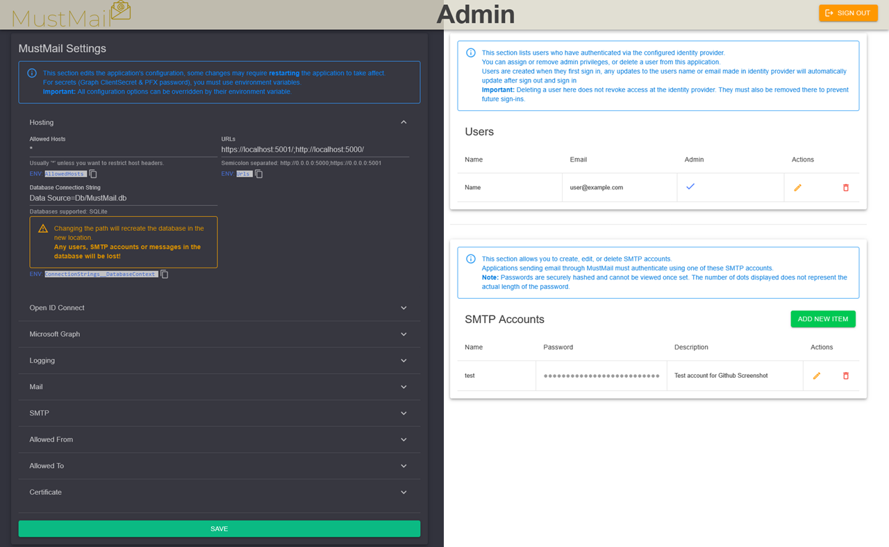
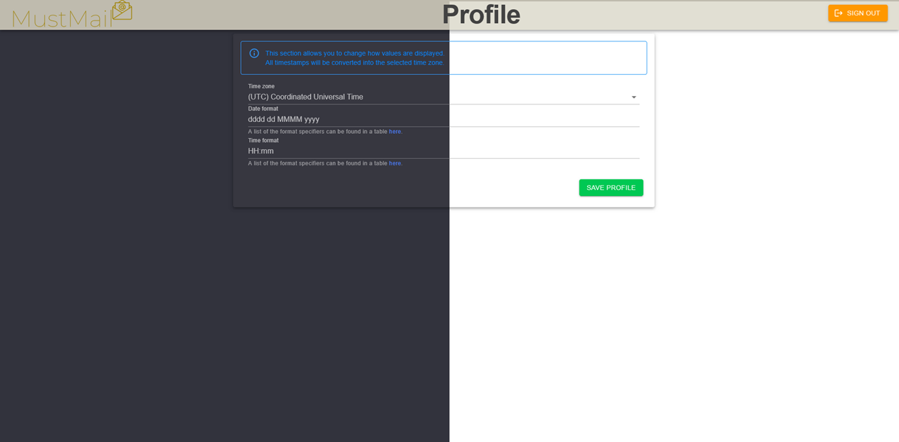

<div align="center">
    
    
    
    
</div>
<br />
<div align="center">
  <a href="https://github.com/bxdavies/MustMail">
    
  </a>
</div>
<h2 align="center"> MustMail </h2>
<p align="center">
    MustMail is a small SMTP server that receives emails and then sends them using Microsoft Graph.
    <br>
    <a href="https://github.com/bxdavies/MustMail/issues">Report Bug</a>
    ·
    <a href="https://github.com/bxdavies/MustMail/discussions">Request Feature</a>
    ·
    <a href="https://github.com/bxdavies/MustMail/discussions">Get Support</a>
</p>

## About
As of January 2023, Microsoft disabled basic authentication for Exchange, requiring users to switch to OAuth. While basic authentication for SMTP AUTH is still available if you have "Security defaults" turned off, this application offers a solution if you want "Security Defaults" enabled and the application you are trying to send emails from does not support SMTP AUTH using OAuth, and you cannot or do not want to use direct send.

An SMTP server and mail gateway that accepts incoming email and relays it through the Microsoft Graph API using OAuth authentication. It supports SMTP authentication, TLS encryption, message storage, and provides a web interface for managing mail.

Features:
- SMTP authentication support
- TLS encryption (STARTTLS and implicit TLS)
- Local mail storage
- Web interface for browsing messages and configuring the application 
- OAuth authentication with Microsoft Graph for outbound delivery
- Restrict allowed sender or recipient addresses
- Send from any user or shared mailbox in your Microsoft 365 Tenant including shared mailboxes and aliases




## Screenshots
<p align="center">
  
  
  
</p>

<p align="center">
 
</p>

## Roadmap

### v0.3.1
 - ~~See if the application can support sending from aliases~~ Implemented 

### v0.4.x
- Support additional database types
- Support additional logging sinks
- Add health check endpoint
- Create SMTP accounts from environment variables so the web interface is not required for initial setup

### v0.5.x 
- Improve To and From restrictions, for example by supporting wildcard patterns such as *@example.com

### v0.6.x 
- Retry failed email deliveries with backoff
- Send delivery errors to a notification address instead of only writing them to the logs

### v0.7.x
- Add support for the Gmail Send API, subject to further research

### v0.8.x 
- Trigger webhooks when emails are received 
- Support a mode that does not require Microsoft Graph or the Gmail Send API, allowing emails to be viewed only through the web interface

### v0.9.x
- Store emails that repeatedly fail to send and notify the notification address so an administrator can review them
- Add an admin dashboard for email statistics
- Add search in the web interface

## Prerequisites
- A Microsoft 365 Tenant.
- A user with appropriate admin roles (Global Administrator, Privileged Role Administrator, Application Administrator, or Cloud Application Administrator) who can grant Application `Mail.Send`, `User.Read.All` and `MailboxSettings.Read` API permissions.
- OIDC provider - e.g Keycloak

## High level setup
1. Create Azure App, see the [Azure App](#azure-app-creation) section.
2. Configure an IDP provider, see the [IDP Configuration](#idp-configuration) section.
3. Run the application, see the [Running MustMail](#running-mustmail) section.
4. First login and SMTP account creation, see the [First Run](#first-run) section.
5. Use MustMail to send an email, see the [Usage](#usage) section.

## Azure App Creation
1. Go to the ['App registrations' section in Azure](https://portal.azure.com/#view/Microsoft_AAD_RegisteredApps/ApplicationsListBlade).
2. Click 'New Registration'.
3. Enter a name and leave everything else as default.
4. Navigate to 'API permissions' pane and click 'Add a permission'.
5. Choose 'Microsoft Graph', then select 'Application permissions', then find `Mail.Send` and tick it. Do the same for `User.Read.All` and `MailboxSettings.Read`. Finally, press 'Add permissions'.
6. Grant admin consent by clicking 'Grant admin consent for Tenant Name' (where Tenant Name is the name of your Microsoft 365 tenant). Hit 'Yes' at confirmation.
7. Navigate to 'Certificates & secrets' pane, choose the 'Client secrets' tab, then click 'New client secret', enter a description and set expiry to 24 months or a custom value. Copy the secret value and set the environment variable `Graph__ClientSecret` to this value.
> [!TIP]
> Set a reminder in your calendar now for 24 months' time to renew and update this secret.
1. Copy the secret value and make note of it.
> [!IMPORTANT]
> The secret value is only displayed once.
1.  Navigate to the 'Overview' pane and copy the 'Application (client) ID' and set the environment variable `Graph__ClientId` to this value. Copy the 'Directory (tenant) ID' and set the environment variable `Graph__TenantId` to this value

## IDP Configuration
To use MustMail you must provide an Identity provider that supports OpenID Connect (OIDC). Instructions for Keycloak and Microsoft Entra are provided but any identity provider should work. 

### Keycloak
[Keycloak](https://www.keycloak.org/) is an Open Source Identity and Access Management.This section details how to use it with MustMail.

1. Navigate to the Administration Console, click 'Clients' from the left hand side and then click 'Create client'.
2. Set name. Set the environment variable `OpenIdConnect__ClientId` to this value.

3. Enable 'Client authentication'.

4. Set 'Root URL', 'Valid redirect URLs' and 'Web origins'. Redirect URL should be address followed by /signin-oidc

5. Once the client has been created, click 'Clients' from the left hand side, find the client, and switch to the Credentials tab. Copy the client secret. Set the environment variable `OpenIdConnect__ClientSecret` to this value.

1. Set the environment variable `OpenIdConnect__Authority` to this value `YOURKEYCLOAKADDESS/realms/YOURREALMNAME/`. Replacing `YOURKEYCLOAKADDESS` and `YOURREALMNAME` respectively. 

### Microsoft Entra ID
[Microsoft Entra ID](https://www.microsoft.com/en-gb/security/business/identity-access/microsoft-entra-id/) is a cloud-based identity and access management solution. This section details how to use it with MustMail.

> [!TIP]
> You can use the same App you created in <a href="#Azure-App-Creation" > Azure App Creation </a> section. If doing this add the Redirect URI by going to the 'Authentication (Preview)' pane, clicking 'Add redirect URI', choosing 'Web' and the using the same redirect URI format in step 2. 
1. Go to the ['App registrations' section in Azure](https://portal.azure.com/#view/Microsoft_AAD_RegisteredApps/ApplicationsListBlade).
2. Click 'New Registration'.
3. Set the app name, select web in the 'Select a platform' dropdown and set the Redirect URI. Redirect URI should be address followed by /signin-oidc.

1. Navigate to the 'Certificates and secrets' pane. Change to the 'Client secrets' tab and click 'New client secret'. Set a description and expiry date and click 'Add'. Copy the secret value and set the environment variable `OpenIdConnect__ClientSecret` to this value.

> [!IMPORTANT]
> The secret value is only displayed once.
1. Navigate to the 'Token configuration' pane and click 'Add optional claim'. Chose ID and then tick the email checkbox. Finally click Add.

> [!IMPORTANT]
> You will get a popup saying "Some of these claims (email) require OpenId Connect scopes to be configured through the API permissions page or by checking the box below. Learn more". **Tick the box 'Turn on the Microsoft Graph email permission (required for claims to appear in token)'.**
1.  Navigate to the 'Overview' pane and copy the 'Application (client) ID'. Set the environment variable `OpenIdConnect__ClientId` to this value.
2.  Click 'Endpoints' and copy the 'Authority URL (Accounts in this organizational directory only)'. Set the environment variable `OpenIdConnect__Authority` to this value.

### Generic
This section details for how to use an Identity provider not listed. 

The `OpenIdConnect__Authority` environment variable should be set to base domain, MustMail will automatically preform OpenID discovery on `/.well-known/openid-configuration`

Redirect URL should be set to /signin-oidc

Client ID and Client Secret must be created in the provider and then set with the `OpenIdConnect__ClientId` and `OpenIdConnect__ClientSecret` environment variables.

MustMail will use the claim `name` by default to fetch the users name, however this can be overridden with  `OpenIdConnect__NameClaim` environment variable.

## Running MustMail

### Docker image

Run MustMail in a container with these simple steps.

#### Docker run
Start MustMail listening on localhost port 9025. Override any environment variable below to match your setup.
```bash
docker run --name MustMail
-e Graph__TenantId="" \
-e Graph__ClientId="" \
-e Graph__ClientSecret="" \
-e OpenIdConnect__Authority=https://keycloak.example.com/realms/master/ \
-e OpenIdConnect__ClientId=mustmail \
-e OpenIdConnect__ClientSecret= \
-e Certificate__Password=Password \
-d ghcr.io/bxdavies/mustmail
```

#### Docker compose
Use Docker Compose for easier management. Fill in your values and you’re ready to go.
```yml
services:
  mustmail:
    image: ghcr.io/bxdavies/mustmail
    container_name: mustmail
    environment:
      - Graph__TenantId=
      - Graph__ClientId=
      - Graph__ClientSecret=
      - OpenIdConnect__Authority=https://keycloak.example.com/realms/master/
      - OpenIdConnect__ClientId=mustmail
      - OpenIdConnect__ClientSecret=
      - Certificate__Password=Password
    restart: unless-stopped
```

Application will start the web interface on port 5000 by default and SMTP sever on 465 and 587 using TLS and autneaction. 

## First run
Before we can use MustMail we need to login and create a SMTP account. Navigate to the web app, you should be redirect to your identity provider to login.  The first account to sign in is automatically assigned an admin role (more users can be set to admin's from the Admin page).

From the homepage (Root or /) click the 'Admin' link below your name, on the admin page (/admin) click the 'Add new SMTP account' button and set name, password and description and click 'Save'.

Now you can use the SMTP account to send an email to MustMail.

## Usage

Set up your application to send emails through MustMail by configuring the SMTP settings like this:

```
SMTP_HOST=localhost
SMTP_PORT=587
SMTP_FROM_EMAIL=servers@example.com
SMTP_SECURE=true
SMTP_USERNAME=test
SMTP_PASSWORD=Password
```

Names for these settings might vary depending on your app—check its documentation if you’re not sure.

If you’re running MustMail in Docker and your app is in another container on the same network, use the container name (e.g. `mustmail`) instead of `localhost` for `SMTP_HOST`.

> [!TIP]
> Test your setup with a simple SMTP test tool to make sure everything’s working before going live.

### Quick SMTP testing with Docker

If you want to quickly test MustMail, you can spin up a test SMTP client container. For example, try [morawskim/swaks](https://hub.docker.com/r/morawskim/swaks):

```bash
docker run --network docker_default --rm -ti morawskim/swaks  \
  --to user@examples.com \
  --from servers@examples.com \
  --server mustmail \
  --port 587 \
  --tls \
  --auth LOGIN \
  --auth-user username \
  --auth-password 'password' \
  --header "Subject: first contact"
```

- `--to` specifies the recipient email address. Replace this with the address you want the test email to be delivered to.
- `--from` specifies the sender email address. This must match a user or shared mailbox that exists in your Microsoft 365 tenant.
- `--server` specifies the hostname of the MustMail SMTP server. If you are running the test container on the same Docker network, you can usually use the container name (e.g. `mustmail`).
- `--port` specifies the SMTP port to connect to. The default submission port is `587`.
- `--tls` enables TLS for the connection. This is required when using STARTTLS on port 587.
- `--auth LOGIN` enables SMTP authentication using the `LOGIN` authentication mechanism.
- `--auth-user` specifies the username for SMTP authentication. This must match the name of an SMTP account configured in MustMail.
- `--auth-password` specifies the password for the SMTP account configured in MustMail.
- `--header "Subject:first contact"` sets the subject line for the test email.

If you’re using Docker Compose or a custom network, update `--network docker_default` to match your setup.

## Configuration

MustMail can be configured in two ways:

1. Environment variables
2. `appsettings.json`

Environment variables always take precedence over values set in `appsettings.json`.

For most users, it is recommended to configure the application through the Admin page. Changes made there are automatically written to `appsettings.json`.

A full configuration reference is provided below for advanced users.

### Using Environment Variables

Any setting in `appsettings`.json can be converted into an environment variable by replacing : with __ (two underscores).

For example, the following setting in `appsettings.json`, `Smtp:Host` becomes the environment variable: `Smtp__Host`.

### Required Environment Variables

For security reasons, the following settings must be provided using environment variables and cannot be loaded from appsettings.json:

- Graph__TenantId
- Graph__ClientId
- Graph__ClientSecret
- OpenIdConnect__Authority
- OpenIdConnect__ClientId
- OpenIdConnect__ClientSecret
- Certificate__Password

If any of these environment variables are missing, MustMail will fail to start.

### appsettings.json reference  
```json
{
  "AllowedHosts": "*",
  "Urls": "https://localhost:5001/;http://localhost:5000/",
  "Smtp": {
    "Host": "localhost",
    "AllowInsecure": false,
    "InsecurePort": 25,
    "ImplicitTLSPort": 465,
    "StartTLSPort": 587
  },
  "OpenIdConnect": {
    "NameClaim": "name"
  },
  "MustMail": {
    "TrustFrom": true,
    "StoreEmails": true,
    "RetentionDays": 7,
    "AllowedFrom": [],
    "AllowedTo": [],
    "FooterBranding": true
  },
  "Certificate": {
    "Managed": true,
    "Path": "Z:\\Apollo\\Projects\\MustMail\\bin\\Debug\\net10.0\\Data\\MustMail.pfx",
    "CommonName": "localhost"
  },
  "Serilog": {
    "Using": [
      "Serilog.Sinks.Console"
    ],
    "MinimumLevel": {
      "Default": "Debug",
      "Override": {
        // Request logs
        "Microsoft.AspNetCore.Hosting.Diagnostics": "Information"
      }
    },
    "WriteTo": [
      {
        "Name": "Console",
        "Args": {
          "theme": "Serilog.Sinks.SystemConsole.Themes.AnsiConsoleTheme::Literate, Serilog.Sinks.Console",
          "outputTemplate": "[{Timestamp:HH:mm:ss} {Level} {SourceContext}] {Message:lj}{NewLine}{Exception}"
        }
      }
    ]
  }
}
```

Serilog configuration details can be found on their wiki [here](https://github.com/serilog/serilog/wiki/Configuration-Basics#minimum-level).

## Contributing
Contributions are what make the open source community such an amazing place to learn, inspire, and create. Any contributions you make are **greatly appreciated**.

If you have a suggestion that would make this better, please fork the repo and create a pull request. You can also simply open an issue with the tag "enhancement".
Don't forget to give the project a star! Thanks again!

1. Fork the Project
2. Create your Feature Branch (`git checkout -b feature/AmazingFeature`)
3. Commit your Changes (`git commit -m 'Add some AmazingFeature'`)
4. Push to the Branch (`git push origin feature/AmazingFeature`)
5. Open a Pull Request

## Acknowledgments

[SmtpServer](https://github.com/cosullivan/SmtpServer) by [Cain O'Sullivan](https://github.com/cosullivan) -  an SMTP Server component written in C#

[Swaks](https://jetmore.org/john/code/swaks/) by [John Jetmore](https://jetmore.org/john/) - Swaks is a featureful, flexible, scriptable, transaction-oriented SMTP test tool

[morawskim/swaks](https://hub.docker.com/r/morawskim/swaks) & [packer-images](https://github.com/morawskim/packer-images) by [Marcin Morawski](https://morawskim.pl/) - Swaks in a docker container.

## License

Distributed under the AGPL-3.0 License. See `LICENSE.txt` for more information.
